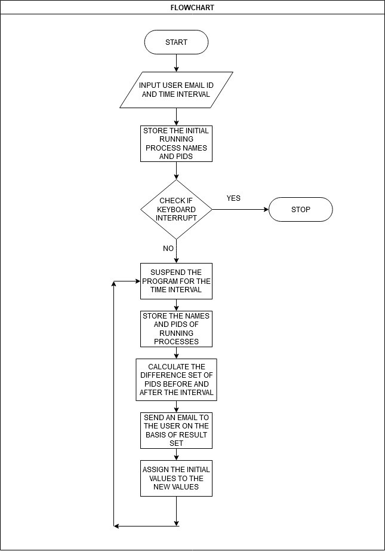
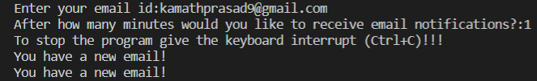
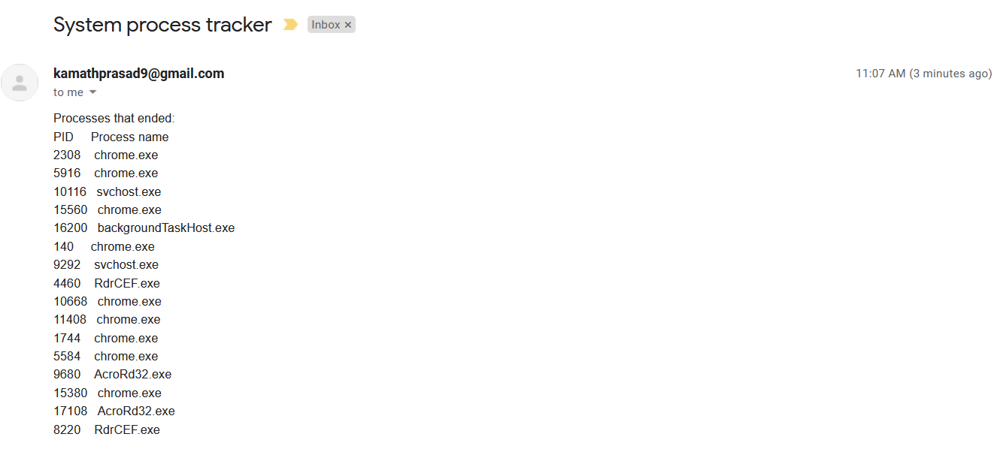
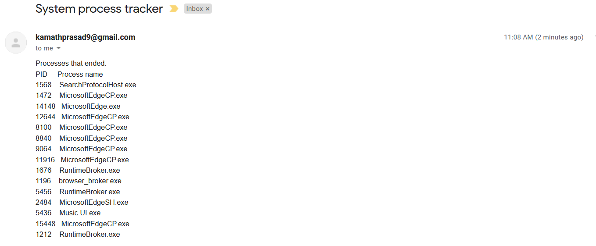

# os-process-track-mail (Operating System Mini Project)

## Description:
This python script keeps tracking the OS system processes after every user defined time interval, checks which processes have stopped/ended, and notifies the same to the user on their email. This script can is flexible to any OS.

## Flowchart:

## Screenshots:

  ### Input and email alert in the terminal:
  

  ### Email recieved by the user:
  
  
  
## How to run this script:
As email-id and password of the admin is sensitive information, it is not written directly in the code. It is obtained from the environment variable, namely "USER_EMAIL" and "USER_PASS". The password used should be App Password generated from respective email domains. Gmail users have toy first enable 2-step verificaton, and then generate app password.
Video tutorial for the same as explained above: 
  ### Generate gmail app password
  https://www.youtube.com/watch?v=ndxUgivCszE
  ### Hiding Passwords and Secret Keys in Environment Variables
  * Windows: https://www.youtube.com/watch?v=IolxqkL7cD8
  * Mac and linux: https://www.youtube.com/watch?v=5iWhQWVXosU
